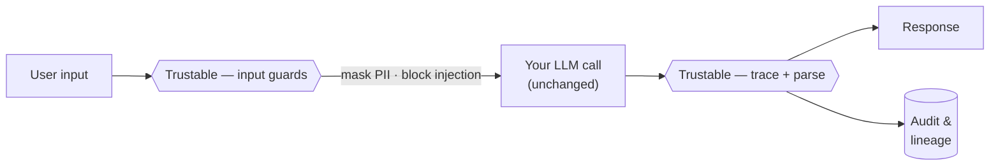

# Trustable

**Guardrails for LLM applications, added the way you'd add a linter — one config file, opt-in, no rewrite.**

---

Most software fails loudly. You get a stack trace, a red build, a 500. LLM software fails quietly. It returns a fluent, confident, well-formatted paragraph that happens to be wrong, or leaks an email address, or does exactly what a stranger hid in the input told it to do. Nothing crashes. Everyone finds out later.

The tooling we built over forty years to keep ordinary software honest — code review, tests, logs, static analysis — mostly doesn't fit the part of the app that talks to a model. You can't review a prompt change in a pull request the way you review a function, because the diff is prose and the behavior is a distribution. You can't test "is this answer good?" with `assertEqual`. You can't grep a log for what the model actually saw when the answer went sideways, because nobody wrote it down.

**Trustable is the missing layer.** It's a modular overlay you drop onto an existing LLM project. You add a `trustable.yaml` to the repo root, install a small Python CLI and SDK, and switch on only the parts you want: security, reviewability, testability, auditability, explainability. It doesn't ask you to rewrite your app or adopt a framework. If Trustable breaks, your app keeps running — the guardrails fail open, on purpose.

Think of it as the seatbelt you can install after buying the car.



---

## Start here

If you read nothing else, read **[Why Trustable exists](docs/why.md)**. It's the argument the whole project rests on.

Then pick the door that matches how you think:

| Door | Page | What's behind it |
| :--- | :--- | :--- |
| 🧭 | **[Why Trustable exists](docs/why.md)** | The problem, stated plainly, and why the obvious fixes don't work. |
| 📦 | **[What's in the box](docs/features.md)** | The five modules, the CLI, and the plugin framework — what each does and why. |
| 🧑‍💼 | **[The Product Manager's view](docs/product-manager.md)** | Who it's for, the job it does, the wedge, and how we'll know it worked. |
| 🏗️ | **[The Architect's view](docs/architecture.md)** | How it's built: capability plugins, a fail-open pipeline, two-pass config. |
| ⚖️ | **[Key decisions](docs/decisions.md)** | The forks in the road and why we went the way we did. |
| 🗺️ | **[Product roadmap](docs/roadmap.md)** | What's shipped, what's next, in dependency order. |
| 🔭 | **[The long game](docs/future.md)** | Where this goes once the foundation is laid. |
| ✨ | **[The art of the possible](docs/art-of-the-possible.md)** | Concrete things that become easy once Trustable is in place. |

---

## Where it stands today

Trustable is being built in sub-projects, foundation first. **Sub-project #1 — the Foundation — is shipped:** the config parser, the plugin framework, the runtime engine, and a working CLI. The five feature modules are scaffolded with real, validated config schemas and land one release at a time. See the **[roadmap](docs/roadmap.md)** for the honest status of each piece.

What works right now:

```bash
trustable init            # scaffold a trustable.yaml + prompts/ and tests/
trustable validate        # check the config, with precise errors
trustable modules list    # see every module, its state, and its capabilities
trustable modules info security
```

## Five-minute quickstart

You'll need **Python 3.11+**. [uv](https://docs.astral.sh/uv/) is the smoothest way in, but plain `pip` works too.

```bash
# 1. Get the code
git clone https://github.com/VikrantKurada/Trustable.git
cd Trustable

# 2. Install it (isolated env recommended)
uv venv && uv pip install -e .
#   or: python -m pip install -e .

# 3. Prove it works
trustable version
trustable init            # drops a trustable.yaml into the current directory
trustable validate        # → "trustable.yaml is valid ..."
trustable modules list    # → the built-in modules and their capabilities
```

A `trustable.yaml` is the whole control surface. You turn things on declaratively:

```yaml
version: "1.0"
project: "my-llm-app"

modules:
  security:
    enabled: true
    pii_masking: ["EMAIL", "API_KEYS"]
    block_injections: true

  audit:
    enabled: true
    sink: "local"
    log_level: "silver"

  test:
    enabled: true
    evaluator_model: "ollama/llama3"
    golden_dataset: "./tests/golden_data.json"

  explainability:
    enabled: true
    capture_rag_context: true
```

> The runtime **SDK** — the `@trustable.trace` decorator that wraps your live model calls, and the real behavior behind `security`/`audit`/`test`/`explainability` — arrives in sub-project #2. Today the Foundation gives you the config surface, the plugin engine those modules snap into, and the CLI. We'd rather tell you that than let you find out.

---

## The four principles

Everything in Trustable is bent toward these. If a feature violates one, it's the feature that's wrong.

1. **Opt-in.** Enable one module or all five. If Trustable fails, your app falls back gracefully — guardrails never take the plane down.
2. **Configurable.** Thresholds, routes, and policies live in declarative YAML, not scattered through your code.
3. **Extendable.** It's a plugin system to the bone. Write a Python scanner, wire an [n8n](https://n8n.io/) alert, point evaluation at a local [Ollama](https://ollama.com/) endpoint — your logic, your call.
4. **Local-first.** Runs on your workstation via Docker. Built to use a beefy local box (an RTX-class GPU, 64 GB of RAM) to run heavy evaluations *before* CI, not after.

---

## Contributing & license

This is early. The [roadmap](docs/roadmap.md) is the best map of where help is useful.

Licensed under **[Apache-2.0](LICENSE)** — permissive, with an explicit patent grant, which is the right fit for a tool meant to be built on. Use it, fork it, ship it. Open an issue if you want to build a module.

The design record lives in the repo, not just in someone's head: see [`docs/superpowers/specs`](docs/superpowers/specs) for the Foundation design and [`docs/superpowers/plans`](docs/superpowers/plans) for how it was built.
