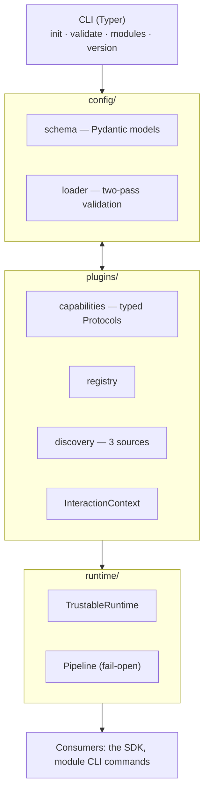

# The Architect's view

[← Back to README](../README.md)

---

An architecture is a set of bets about what will change. Get the bets right and the system absorbs new requirements quietly; get them wrong and every new feature is a fight. Trustable makes one central bet: **the modules will change constantly, and the engine underneath them almost never.** Everything else follows from taking that seriously.

If you want the full blueprint, it's in the repo: [`docs/superpowers/specs/2026-08-07-trustable-foundation-design.md`](superpowers/specs/2026-08-07-trustable-foundation-design.md). This page is the tour and the reasoning.

## The shape

Five parts, each with one job. `config` turns a YAML file into validated objects. `plugins` is the extensibility spine — what a module *is* and how it's found. `runtime` assembles enabled modules into an ordered pipeline. `cli` is the terminal front door. The consumers — the SDK that wraps live model calls, the commands modules add — sit on top.

## The four bets, and why

**Bet 1: Capabilities, not inheritance.** A module doesn't extend a big base class with twenty methods it mostly ignores. It implements small, typed *capability* interfaces — `InputGuard`, `OutputGuard`, `Tracer`, `CommandProvider` — and only the ones it actually has. A security scanner is an `InputGuard`. The audit module is a `Tracer`. The test module is a `CommandProvider`. The engine inspects an instance, sees which capabilities it satisfies, and slots it into the matching stage of the pipeline.

The alternative we rejected was an event bus — modules publishing and subscribing to named events. It's more decoupled on paper and worse in practice: the moment a guard needs to *block* a request synchronously, or run in a deterministic order, pub-sub turns into a debugging nightmare. Guardrails are exactly that case. So: explicit, ordered, typed. ([Why, at length →](decisions.md#3-capability-protocols--a-pipeline-not-an-event-bus))

**Bet 2: The core knows nothing about any module's config.** The config loader validates in two passes. The first checks the envelope — is `project` present, is `modules` a map? The second takes each module's raw config block and validates it against *that module's own registered schema*. The security module owns the schema for `pii_masking`; the audit module owns the schema for `log_level`. The core parser has never heard of either.

This is the difference between extensible and extensible-in-a-slide-deck. If the core hard-coded every module's fields, every new module would mean editing the core. Because it doesn't, a third-party plugin gets the same precise, friendly validation as a built-in, for free.

**Bet 3: Fail-open is a load-bearing wall, not a nicety.** Every module invocation in the pipeline is wrapped. A module that raises is logged and skipped; the interaction proceeds. The *only* thing that stops an interaction is a security guard deliberately setting `blocked` — a decision, distinguishable in the code from a crash. Config-time is the opposite: there we fail *loud*, with precise errors and a non-zero exit, because a broken config should never reach production silently.

The reason this is architecture and not a `try/except` someone remembered to add: it's the promise that makes the whole tool adoptable. A governance layer that can take down the product is a governance layer that stays off. Fail-open is what lets a nervous team flip the switch.

**Bet 4: One object carries the interaction.** A single `InteractionContext` — prompt, response, metadata, structured records, the block flag — threads through every stage. Guards mutate it (mask the prompt, append a record); the tracer reads it; the pipeline inspects it to decide whether to short-circuit. It's the shared spine that lets independent modules cooperate without knowing about each other.

## How a module actually plugs in

Three doors, checked in order: the **built-ins** that ship in the box; any installed **Python package** that advertises itself under the `trustable.modules` entry-point group; and explicit **paths in your `trustable.yaml`** for local, in-repo modules. A broken plugin becomes an error row in `trustable modules list`, not a crash — discovery is as fail-open as the runtime.

Writing a module is small on purpose: declare a `ModuleSpec` (name, factory, config schema, priority), and have your instance implement whatever capabilities it offers. The reference `NoopModule` implements all four in about forty lines and exists precisely to be copied.

## Where the seams are — and the honest tradeoffs

No architecture is free. The ones Trustable chose to pay:

- **A fixed set of capabilities.** New *kinds* of extension point require adding a capability protocol to the core. That's deliberate — we'd rather add the few the modules actually need than ship a speculative hook zoo — but it means the truly novel plugin might need a core change. We think that's the right trade for a system whose extension points are, so far, well understood.
- **Introspection over declaration.** The engine figures out a module's capabilities by instantiating it and checking types, which is elegant but means a factory that throws on construction is a thing to handle carefully. It's guarded, but it's a seam to know about.
- **Two clocks.** Some modules run at request time (in your app), some at dev/CI time (in the pipeline). One config file spans both. That unity is a feature, but it means "when does this run?" is a question you have to keep straight. The docs try to; the design has to.

## What it deliberately isn't

It isn't a message queue, a workflow engine, or a distributed system. It's an in-process library and a CLI. The medallion audit tiers, the enterprise sinks, the alerting — those are *routes out*, integrations at the edge, not the core. Keeping the core a small, synchronous, in-process thing is what keeps it debuggable and local-first. The moment the engine itself needs a broker to run, we've lost the plot.

The foundation is built and tested — 47 tests, a proven end-to-end path from `trustable.yaml` to an assembled pipeline. The interesting work now is filling in the modules, which is exactly the work the architecture was shaped to make small.

---

**Next:** [Key decisions →](decisions.md) · [What's in the box →](features.md)
