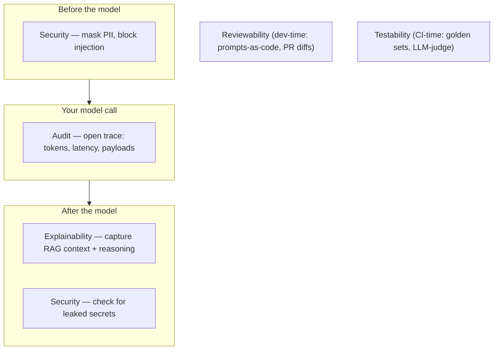

# What's in the box

[← Back to README](../README.md)

---

Trustable is five feature modules sitting on one small engine. The engine — config parsing, a plugin registry, and a fail-open runtime pipeline — is the part that already ships; the modules snap into it. This page is the honest tour: what each thing does, why it earns its place, and whether it's built yet.

A quick legend: **✅ shipped** means it works today; **🚧 scaffolded** means the config schema and the seam it plugs into exist now, and the behavior lands in a coming release. The [roadmap](roadmap.md) has the full schedule.

---

## The engine (✅ shipped)

Before the modules, the thing they stand on.

- **Config parser.** A `trustable.yaml` is validated in two passes: first the envelope (is this even a valid config?), then each module's block against *that module's own* schema. So `log_level: platinum` fails with a precise, pointed error instead of a mystery. The core parser doesn't hard-code what a module's config looks like — each module owns its schema. That's what keeps the system genuinely extensible instead of extensible-in-theory.
- **Plugin framework.** Modules are discovered from three places: the built-ins, any installed Python package that advertises itself, and paths you list in your config. A module declares which *capabilities* it has — does it guard inputs? outputs? trace calls? add CLI commands? — and the engine wires it into the right place. Writing a new module is implementing a small, typed interface, not learning a framework.
- **Runtime pipeline.** One interaction flows through an ordered pipeline: input guards, then your model call, then output guards, with a trace wrapped around the whole thing. It's **fail-open** by construction — a module that throws is logged and skipped so your app proceeds. The one deliberate exception is a security guard *choosing* to block, which is a decision, not a failure.
- **The CLI.** `init`, `validate`, `modules list`, `modules info`, and dynamic mounting of any command a module wants to add. This is how you drive Trustable from the terminal and from CI.

Everything below plugs into that. Which is the point: the hard architectural work is done once, and each module is small.

---

## 1. Reviewability — *Prompts as code* 🚧

**The goal:** make a prompt change reviewable in an ordinary pull request.

- **Prompt registry.** Prompts get pulled out of your business logic into version-controlled files, loaded by id and version: `load_prompt("summarize", "v3")`. Now a prompt has a history, an owner, and a diff.
- **Semantic diffing.** A GitHub Action comments on your PR showing exactly which tokens a prompt change added or removed — so a reviewer sees *"you dropped the word 'concise'"* instead of *"the prompt file changed."*

Why it matters: the prompt is the most behavior-defining, least-reviewed artifact in most LLM apps. This drags it into the light.

## 2. Testability — *Pluggable evaluation* 🚧

**The goal:** test meaning, not string equality.

- **Golden-dataset runner.** `trustable test` runs a fixed set of inputs through your model on every commit and prints a pass/fail matrix.
- **LLM-as-a-judge.** Configure a second model to *score* the first one's outputs — routed to a local endpoint (Ollama on `localhost:11434`) or a remote API, your choice.
- **Custom assertions.** YAML rules — "response must be valid JSON," "under 500 tokens," "must not mention a competitor" — that fail the CI build when breached.

Why it matters: without this, "did that prompt change make things worse?" is answered by vibes. This answers it with a number, in CI, before merge.

## 3. Auditability — *Structured telemetry* 🚧

**The goal:** an immutable, structured record of every interaction.

- **OpenTelemetry wrappers.** A `@trustable.trace` decorator auto-instruments the popular libraries (LangChain, OpenAI, LiteLLM) to capture latency, tokens, and the raw request/response — the thing your logs are missing.
- **Medallion-structured sinks.** Logs organized in tiers — *Bronze* (raw), *Silver* (cleaned), *Gold* (aggregated) — ready to route into enterprise platforms like Databricks with Unity Catalog governance.

Why it matters: this is what turns "why did it say that?" from a shrug into a query.

## 4. Security — *Injection & leakage guards* 🚧

**The goal:** sanitize what goes in and what comes out, in real time.

- **PII / secret masking.** Regex- and NLP-based scanning redacts sensitive data *before* it reaches the model API. Configurable: `mask_entities: [EMAIL, CREDIT_CARD]`.
- **Injection scanning.** User input is checked against known prompt-injection heuristics; a high-risk prompt gets an immediate rejection without ever hitting the model.

Why it matters: it's the forty-year-old "don't trust user input" rule, finally ported to the case where the input *is* an instruction.

## 5. Explainability — *Context lineage* 🚧

**The goal:** the *why* behind an answer, especially for retrieval (RAG).

- **Context-retention logging.** Records exactly which retrieved chunks produced an answer, with their similarity scores — an array of `source_documents` next to the output.
- **Reasoning extraction.** Captures the model's chain-of-thought into a hidden data object and files it in the Silver-tier audit logs, so the reasoning is inspectable without being shown to the user.

Why it matters: for RAG apps, "the model made it up" and "the model faithfully used a wrong document" are completely different bugs, and this is how you tell them apart.

---

## How the pieces fit

The five modules aren't a suite you swallow whole. They're independent guards on a shared timeline — some run before the model, some after, one wraps the whole call — coordinated by the engine:

Reviewability and Testability run at *dev and CI time*; Security, Audit, and Explainability run at *request time*. Same config file, same plugin engine, two clocks.

---

**Next:** [How it's built →](architecture.md) · [The decisions behind it →](decisions.md)
